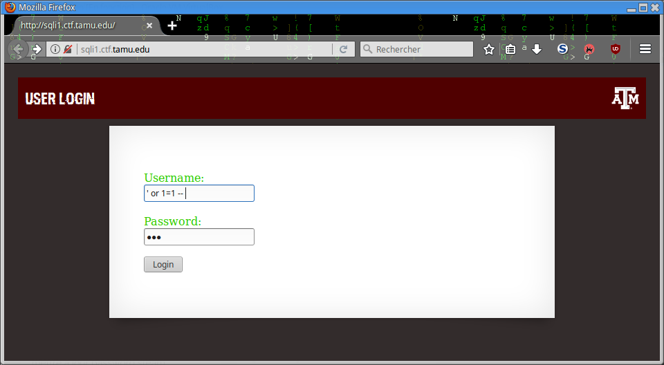
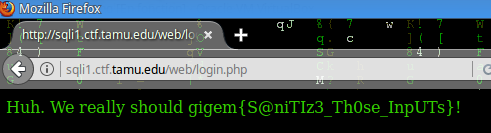

## input
sqli1.ctf.tamu.edu  
Oh, how lovely it would be if you could log in as admin.  
The data you could find, flags that would be there...  

## output
We have a form that return __Dat be invalid login info!__ if we try the wrong login/password.  

Just input the classic SQL injection:

And you obtain the flag:

